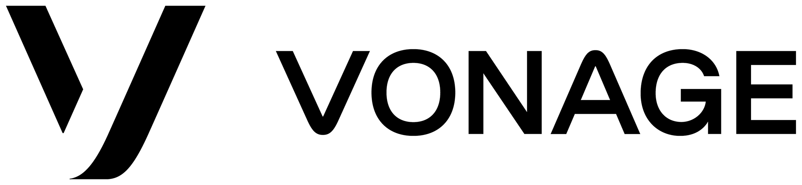
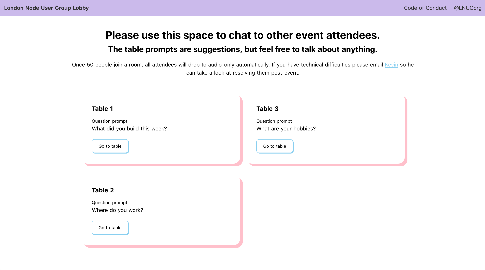

# Social Cafe

> An online social space to have video conversations around prompts.



## Adding your own event

Refer to the guide in our [contributing guidelines][contributing] on adding events.

## Deploy your own

1. Create a new Video Chat Embed project on OpenTok. Take note of the Embed ID.
2. Deploy this project to Netlify with these settings:
    1. Build command: `npm run build`
    2. Publish directory: `dist`
3. Inside of the build settings - set `EMBED_ID` to the OpenTok Embed ID.
4. Set up any events and rooms you want accessible at `store/index.js`
5. Verify that the Website URL in your OpenTok proejct settings is the same as your Netlify URL.

You can skip steps 2 and 3 by using this button:

<a href="https://app.netlify.com/start/deploy?repository=https://github.com/phazonoverload/social-cafe"></a>

## Build Setup

```bash
# install dependencies
$ npm install

# serve with hot reload at localhost:3000
$ npm run dev

# build for production and launch server
$ npm run build
$ npm run start

# generate static project
$ npm run generate
```

[contributing]: CONTRIBUTING.md "Contributing"

## Code of Conduct

In the interest of fostering an open and welcoming environment, we strive to make participation in our project and our community a harassment-free experience for everyone. Please check out our [Code of Conduct][coc] in full.

## Contributing
We :heart: contributions from everyone! Check out the [Contributing Guidelines][contributing] for more information.

[![contributions welcome][contribadge]][issues]

## License

This project is subject to the [MIT License][license]

[logo]: vonage_logo.png "Vonage"
[contribadge]: https://img.shields.io/badge/contributions-welcome-brightgreen.svg?style=flat "Contributions Welcome"

[coc]: CODE_OF_CONDUCT.md "Code of Conduct"
[contributing]: CONTRIBUTING.md "Contributing"
[license]: LICENSE "MIT License"

[issues]: ./../../issues "Issues"
